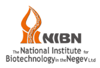

====================================================
Welcome to mompS tool's documentation!
====================================================

**Software author**: Dr. Michal Gordon, Bioinformatics Core Facility, Ben-Gurion University, Israel

**PI**: Prof. Jacob Moran-Gilad, Faculty of Health Sciences, Ben-Gurion University, Israel

**Citation**: Gordon, M., Yakunin, E., Valinsky, L., Chalifa-Caspi, V., & Moran-Gilad, J. (2017). A Bioinformatics Tool for Ensuring the Backwards Compatibility of Legionella pneumophila Typing in the Genomic Era. Clinical Microbiology and Infection.‏‏

**Date**:   29/1/2017

Why should I need this?
-------------------------

Whole genome sequencing (WGS) has revolutionized the subtyping of L. pneumophila (Lp) but calling the traditional sequence based type from genomic data is hampered by presence of multiple copies of the mompS locus. We propose a novel bioinformatics solution for rectifying that limitation, ensuring the feasibility of WGS for cluster investigation. 

Usage
---------

1. Download or clone the momps folder to your unix
2. In 'config.txt', set the path to blast, bwa, samtools, picard and freebayse
3. cd into the momps folder
4. Run the program as follow:

        perl momps.pl   \
            -f forward_fastq_file.fq   \
            -r reverse_fastq_file.fq   \
            -a assembly_file.fasta   \
            -o output_folder_name/ \
            -p prefix

        
    
Where:

    -f        full path to forward fastq file
    -r        full path to reverse fastq file
    -a        full path to assembly fasta file
    -o        output folder for the results
    -p        prefix (e.g. sample_1)

Results
-------

The analysis results are summarized in file prefix.MLST_res.txt

Dependencies
-------------

* blast (ncbi-blast-2.4.0+)
* bwa (bwa-0.7.5a)
* samtools (1.3.1)
* picard (picard-1.139)
* freebayse (v1.0.2-15-g357f175)
* perl
